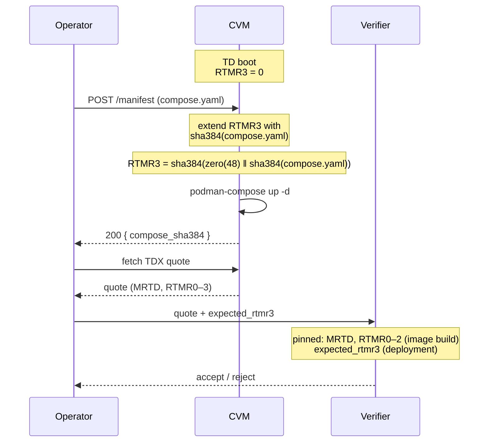

# cvm-provisioner

> **⚠ Work in progress — not production ready.**
> This is an early proof-of-concept exploring runtime workload deployment
> into a base TDX CVM with RTMR3 extension. Interfaces, on-disk layout,
> and the wire format will change. There is no authentication on the HTTP
> endpoints, no LUKS-backed persistence yet, and no formal security review.
> Do not use to host anything you care about.

In-CVM agent that receives a docker-compose manifest at runtime, extends RTMR3
with its SHA384, and launches the workload via `podman-compose`. Paired with
a fixed base TDX image whose MRTD and RTMR0–2 are pinned at build time, this
lets a single image host arbitrary workloads while the deployment configuration
remains hardware-attested.

## Model



On TD reboot the persisted manifest is replayed deterministically, so RTMR3
returns to the same value. Updates require a TD reboot in v0.

## What's measured

| Register | Bound at | Contents |
|----------|----------|----------|
| MRTD | image build | firmware + initial TD state |
| RTMR0–2 | image build | UKI, kernel, cmdline |
| RTMR3 | first boot after deployment | `SHA384(zero(48) ‖ SHA384(compose.yaml))` |

Only the compose file is measured. `.env` content is treated as a runtime secret
and is **not** included in RTMR3. This is a deliberate v0 trade-off; changing
env vars changes workload behaviour without changing the attestation.

## Binaries

### `cvm-provisioner` (the service)

```
cvm-provisioner \
    --listen :8888 \
    --state-dir /var/lib/cvm-provisioner \
    --runtime-dir /run/cvm-provisioner \
    --mode auto
```

`--mode`:
- `auto` (default): use the real TDX kernel interface if present, otherwise
  fall back to a logging mock. Suited for local development.
- `real`: require the TDX interface, exit 1 if missing. Use this in production.
- `mock`: force mock regardless of host capability. Useful for CI/integration tests.

### `compute-expected-rtmr3` (verifier helper)

```
$ compute-expected-rtmr3 < compose.yaml
compose_sha384:    8f3a...c2d1
expected_rtmr3:    3b71...0e9a
```

The verifier pins `expected_rtmr3` alongside MRTD + RTMR0–2 from the image build.

## HTTP API (v0)

- `POST /manifest` — body: `{"compose": "<yaml>", "env": "<optional kv text>"}`. Returns 200 with the digest, or 409 if already provisioned this boot.
- `GET /status` — JSON: `{provisioned, compose_sha384, extend_mode, rtmr3_extended, compose_bytes}`.
- `GET /healthz` — 200 OK.

No authentication in v0. **Front with `attested-tls-proxy` for any non-demo use.**

## Boot flow

1. systemd starts `cvm-provision.service` after the persistent disk is mounted.
2. If `/run/cvm-provisioner/extended` exists → this boot already provisioned; idempotent. Skip extend, keep serving `/status`.
3. Else if `compose.yaml` exists in `--state-dir` → replay: SHA384 → extend RTMR3 → `podman-compose up -d` → write tmpfs flag.
4. Else → wait for `POST /manifest`, then same path as (3).

The tmpfs flag prevents systemd restarts from double-extending RTMR3 within one boot.

## Local development

You cannot exercise actual RTMR3 mutation without a TDX host. The mock mode
logs `MOCK extend RTMR3 <- sha384=...` and lets the full HTTP + compose loop
run on any laptop.

```
go run ./cmd/cvm-provisioner --mode mock --state-dir /tmp/cvmp --runtime-dir /tmp/cvmp-run

# in another shell:
jq -n --rawfile compose ./examples/hello.yaml '{compose:$compose}' \
  | curl -X POST --data-binary @- http://localhost:8888/manifest
curl http://localhost:8888/status
```

Real validation: deploy the cvm-base image to a GCP confidential VM (TDX SKU).

## Roadmap

- **v0:** this. HTTP + extend + compose. No persistence beyond rootfs.
- **v1:** LUKS-backed `/persistent` via `tdx-init set-passphrase`. Private registry auth in the manifest. Structured secrets.
- **v2:** `attested-tls-proxy` fronting. Ed25519 mTLS update endpoint à la `input-only-proxy`.
