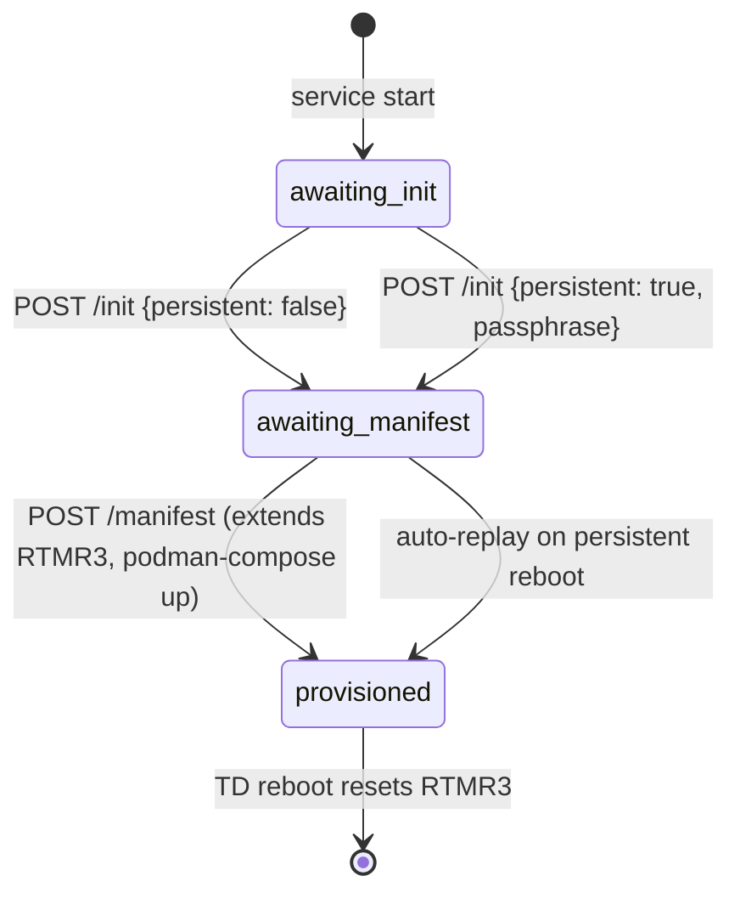
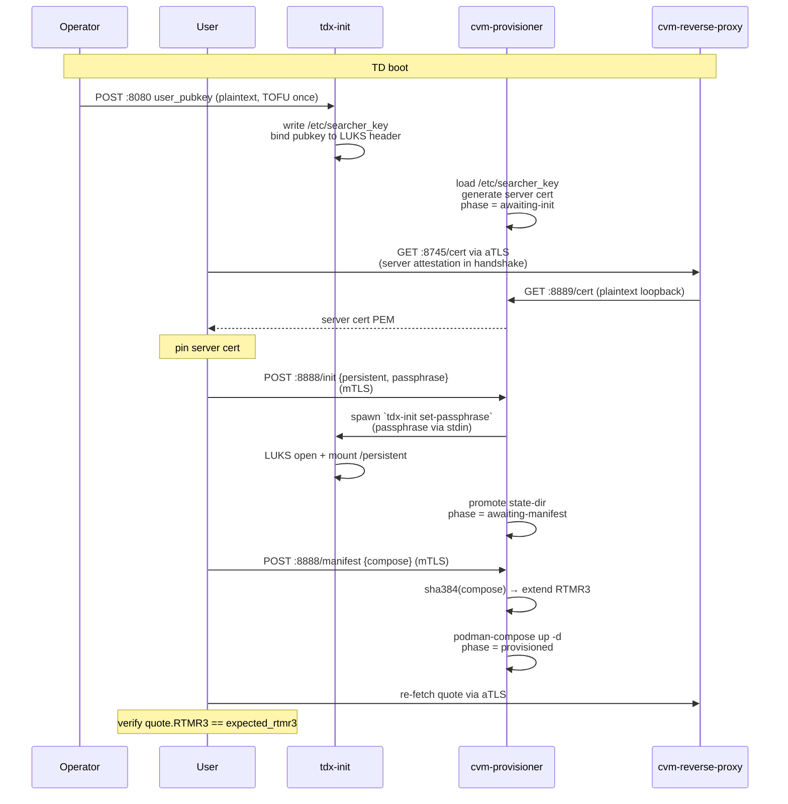
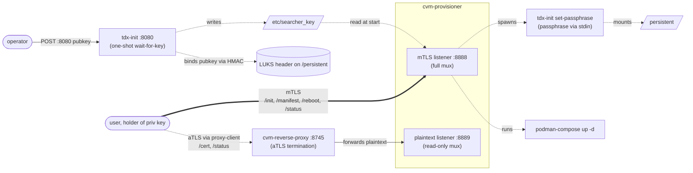

# cvm-provisioner

> **⚠ Work in progress — not production ready.**
> Early proof-of-concept exploring runtime workload deployment into a base
> TDX CVM with RTMR3 extension. Interfaces, on-disk layout, and the wire
> format will change. No formal security review has been done. Do not use
> to host anything you care about.

In-CVM agent that owns LUKS bring-up + manifest deployment behind a single
mTLS-authenticated HTTP API. Paired with a fixed base TDX image whose MRTD
and RTMR0–2 are pinned at build time, a CVM running cvm-provisioner can
host arbitrary docker-compose workloads while the deployment configuration
remains hardware-attested via RTMR3.

## Repos involved

| Repo | Role |
|---|---|
| `flashbots/cvm-provisioner` (this one) | provisioner service + `cvm-ctl` client + `scripts/ssh_to_tls_cert.py` |
| `flashbots/flashbots-images` branch `moe/cvm-base-image` | base CVM image that bakes the provisioner in |
| `flashbots/tdx-init` | LUKS bring-up + SSH-pubkey delivery (called as subprocess by `/init`) |
| `flashbots/cvm-reverse-proxy` | aTLS front for the read endpoints |

## Trust model

| Actor | Authority | Actions |
|---|---|---|
| **Operator** | runs the image (cloud team) | POSTs the user's SSH pubkey to `tdx-init:8080` once at deploy time |
| **User** | holds the SSH private key | Drives everything else via mTLS: `/init`, `/manifest`, `/reboot`, `/status` |

The operator has no special access after the TOFU step. They can power-cycle
the CVM but cannot drive any protected endpoint — they do not hold the
user's private key, which is required for the mTLS client cert.

## Endpoints

All on a single TLS listener (`0.0.0.0:8888` by default). Auth is
per-handler: writes require mTLS where the client cert's ed25519 pubkey
matches `/etc/searcher_key`; reads are open.

| Method | Path | Auth | Valid when | Action |
|---|---|---|---|---|
| GET | `/healthz` | none | always | liveness |
| GET | `/cert` | none | always | returns the provisioner's self-signed server cert PEM for pinning |
| GET | `/status` | none | always | phase + modes + digest (if provisioned) |
| POST | `/init` | mTLS | phase = awaiting-init | optional LUKS bring-up; transitions to awaiting-manifest |
| POST | `/manifest` | mTLS | phase = awaiting-manifest | extends RTMR3 + `podman-compose up` |
| POST | `/reboot` | mTLS | always | spawns `/sbin/reboot` |

The same handlers are also exposed on a **plaintext loopback listener**
(`127.0.0.1:8889`) for the read subset only. `cvm-reverse-proxy` forwards
into this loopback so its aTLS channel exposes `/cert` and `/status` to
remote callers; the write endpoints stay direct-mTLS only.

## Phase machine



- `awaiting-init` — service up, init not yet called.
- `awaiting-manifest` — `/init` succeeded; state-dir promoted; manifest not yet received.
- `provisioned` — `/manifest` succeeded; RTMR3 extended; workload running; further `/manifest` returns 409 until TD reboot.

## Ephemeral vs persistent

`POST /init` accepts an optional flag:

| Mode | Request body | Effect |
|---|---|---|
| Ephemeral (default) | `{}` or `{"persistent": false}` | No LUKS. State on `/run/cvm-provisioner/state/` (tmpfs). Cleared on TD reboot — every boot starts fresh. Simple update path: reboot, re-init, re-deploy. |
| Persistent | `{"persistent": true, "passphrase": "..."}` | Drives `tdx-init set-passphrase` (passphrase piped to stdin). State swaps to `/persistent/cvm-provisioner/`. Deterministic replay on reboot: same compose bytes → same RTMR3. |

The persistent mode binds disk encryption to the user's SSH pubkey via
`tdx-init`'s HMAC-in-LUKS-header scheme. The same `/etc/searcher_key`
that authenticates mTLS clients also gates LUKS re-unlock on subsequent
boots.

## RTMR3 binding

```
extend_input    = SHA384(compose.yaml bytes, exactly as POSTed)
RTMR3_expected  = SHA384(zero(48) ‖ extend_input)
```

- Only the compose file is measured. `.env` content (if provided) is treated as a runtime secret and is **not** included in RTMR3.
- Compose bytes must be byte-identical across reboots in persistent mode (no YAML canonicalisation).
- The same RTMR3 value is observable two ways: read via the TLS handshake's TDX quote (hardware-attested), or via `GET /status` (software view). Both should match.

`compute-expected-rtmr3` produces the pinned value offline:

```
$ compute-expected-rtmr3 < compose.yaml
compose_sha384:    8f3a...c2d1
expected_rtmr3:    3b71...0e9a
```

## Auth mechanism

- **Server cert:** self-signed ed25519, generated at startup in `/run/cvm-provisioner/server.{crt,key}`. Regenerated each TD boot. Pinned by clients after first `bootstrap`.
- **Client cert:** derived from the user's SSH ed25519 private key via `scripts/ssh_to_tls_cert.py`. The cert's public key bytes are compared (constant time) against `/etc/searcher_key` — the raw OpenSSH wire-format pubkey that `tdx-init wait-for-key` writes.
- **TLS chain verification is disabled:** both certs are self-signed and have no CA. Identity is established by pinned-bytes match on each side.

## Boot flow



## Process layout inside the CVM



## Binaries

This repo builds three:

- **`cvm-provisioner`** — the service. Runs inside the CVM.
- **`cvm-ctl`** — the user-side CLI. Runs on the user's laptop.
- **`compute-expected-rtmr3`** — verifier helper; computes the pinned RTMR3 offline.

## cvm-ctl usage

```bash
# one-time, on the user's laptop:
python3 scripts/ssh_to_tls_cert.py ~/.ssh/id_ed25519 ~/.config/cvm-ctl/client.pem

# bootstrap: fetch + pin the provisioner's server cert.
# Production: --via http://localhost:N where N is the local port of
#   cvm-reverse-proxy proxy-client --target https://<cvm>:8745
# Demo: omit --via to fetch directly (TOFU; only safe with out-of-band trust).
cvm-ctl bootstrap --cvm cvm.example.com:8888

# init: --persistent triggers LUKS bring-up. Prompts for passphrase.
cvm-ctl init --cvm cvm.example.com:8888 --persistent

# deploy a manifest (flags before the positional path).
cvm-ctl deploy --cvm cvm.example.com:8888 ./compose.yaml

# inspect.
cvm-ctl status --cvm cvm.example.com:8888

# reboot the CVM.
cvm-ctl reboot --cvm cvm.example.com:8888
```

Flags are accepted **after** the subcommand (stdlib `flag` parsing).

## Local development (mock mode)

Real RTMR3 extension requires TDX hardware. For laptop iteration, run
the provisioner in mock mode. You need an ed25519 SSH keypair to drive
the mTLS leg (generate one if you don't already have it):

```bash
# 1. SSH key (skip if you already have ~/.ssh/id_ed25519).
ssh-keygen -t ed25519 -f /tmp/dev_ed25519 -N ""

# 2. Convert to a TLS keypair for cvm-ctl's mTLS client.
python3 scripts/ssh_to_tls_cert.py /tmp/dev_ed25519 /tmp/client.pem

# 3. Extract the OpenSSH wire-format pubkey for the provisioner's
#    --authorized-pubkey-file (tdx-init writes the same shape in production).
ssh-keygen -y -f /tmp/dev_ed25519 | awk '{print $2}' > /tmp/searcher_key

# 4. Run the provisioner.
mkdir -p /tmp/run /tmp/mount
go run ./cmd/cvm-provisioner \
    --listen 127.0.0.1:8888 \
    --listen-loopback 127.0.0.1:8889 \
    --runtime-dir /tmp/run \
    --persistent-mount /tmp/mount \
    --authorized-pubkey-file /tmp/searcher_key \
    --mode mock

# 5. From another shell, drive it.
go build -o /tmp/cvm-ctl ./cmd/cvm-ctl
/tmp/cvm-ctl bootstrap --cvm 127.0.0.1:8888 --cert /tmp/client.pem --pinned-cert /tmp/server.pem
/tmp/cvm-ctl init      --cvm 127.0.0.1:8888 --cert /tmp/client.pem --pinned-cert /tmp/server.pem
/tmp/cvm-ctl deploy    --cvm 127.0.0.1:8888 --cert /tmp/client.pem --pinned-cert /tmp/server.pem ./compose.yaml
/tmp/cvm-ctl status    --cvm 127.0.0.1:8888 --cert /tmp/client.pem --pinned-cert /tmp/server.pem
```

`--mode mock` simulates both the RTMR3 extension (logged as `MOCK extend
RTMR3 <- sha384=...`) and the LUKS bring-up (just `mkdir`s the persistent
path). `podman-compose` is still required if you want the workload to
actually run; without it the provisioner logs the extension and returns
500 on the compose step — but the RTMR3 + state transitions are still
observed correctly via `/status`.

## HTTP API reference

### `POST /init`
Request body (JSON):
```json
{ "persistent": false, "passphrase": "..." }
```
- `persistent` (bool, default `false`): if `true`, triggers LUKS bring-up.
- `passphrase` (string): required when `persistent` is `true`; ignored otherwise.

Response (200):
```json
{ "phase": "awaiting-manifest", "persistent": false, "compose_sha384": "..." }
```
`compose_sha384` is present only if a persisted manifest was auto-replayed.

Errors: 400 (bad JSON, missing passphrase), 409 (already initialized).

### `POST /manifest`
Request body (JSON):
```json
{ "compose": "<yaml bytes>", "env": "<optional kv text>" }
```

Response (200):
```json
{ "phase": "provisioned", "compose_sha384": "8f3a...c2d1", "extend_mode": "tdx" }
```

Errors: 400 (bad JSON, empty compose), 412 (init not done), 409 (already provisioned).

### `GET /status`
```json
{
  "phase": "awaiting-init | awaiting-manifest | provisioned",
  "extend_mode": "tdx | mock",
  "init_mode": "tdx | mock",
  "persistent": false,
  "compose_sha384": "...",
  "compose_bytes": 173
}
```

### `GET /cert`
Returns the self-signed server cert as `application/x-pem-file`.

### `POST /reboot`
202 Accepted; spawns `/sbin/reboot` asynchronously so the response can flush.

### `GET /healthz`
200 OK with body `ok`.
